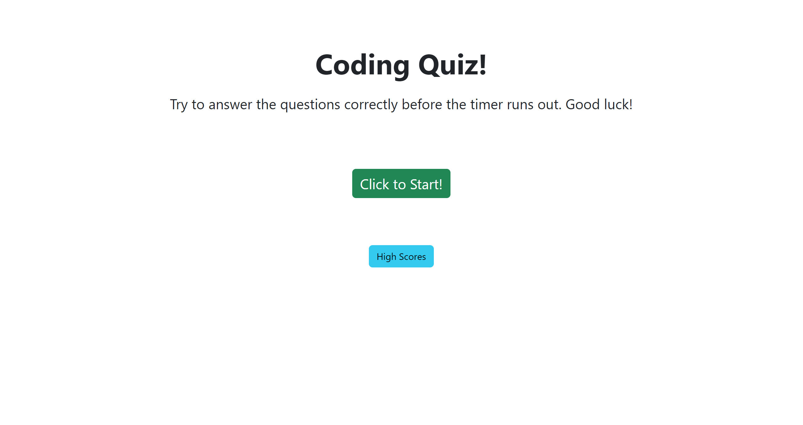

# code-quiz

## Description

This project was completed so users could take a coding quiz and submit their scores.

## Installation

N/A

## Usage

Users can take a quiz on coding questions, including topics from HTML, CSS, and Javascript. They can then submit their initials and scores, and they will be saved to their local storage. They can also click a button to clear out the initials and scores from local storage. 

## Credits

N/A

## License

MIT License

## Deployment

Link to the deployed website: https://katycaroline.github.io/code-quiz/